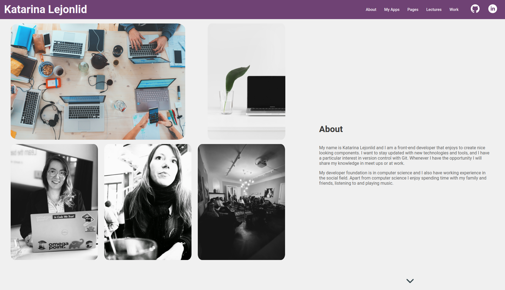

# Portfolio for Katarina Lejonlid

An application highlighting skills and competences in a portfolio style:

You can also visit the app on [dev-portfolio page](https://kattisa.github.io/dev-portfolio/).

## Description

A React app using Sass. With this tutorial I have learned more about:
- React components
- React Hooks
- Sass/scss, variables, mixins and nesting
- Flexbox
- Pure CSS (not using any library)
- Making the site responsive using own CSS
- Creating a better UI using multiple shades of color

I also dived into Refactoring UI book and tried to apply some UX/UI color tricks to create 
a more visually appealing site. I looked for ways to implement different shades of colors 
and creating a palette with primary, accent and grey colors.

## Future improvements

There can always be improvements to everything. So here are some thoughs on that:
- Making the app more consistent regarding the CSS
- Extracting const into utils or similar (ex: pagesList)
- More mobile view improvements

## Getting Started

After cloning the project run npm install. To start the project type npm start in the console and to stop ctrl + C.

### Dependencies

* Node and npm

### Installing

Use React documentation to install.

## Authors

By Katarina Lejonlid.

## Acknowledgments

Inspiration, code snippets, etc.
* [portfolio-app](https://github.com/kattisA/portfolio-app)
